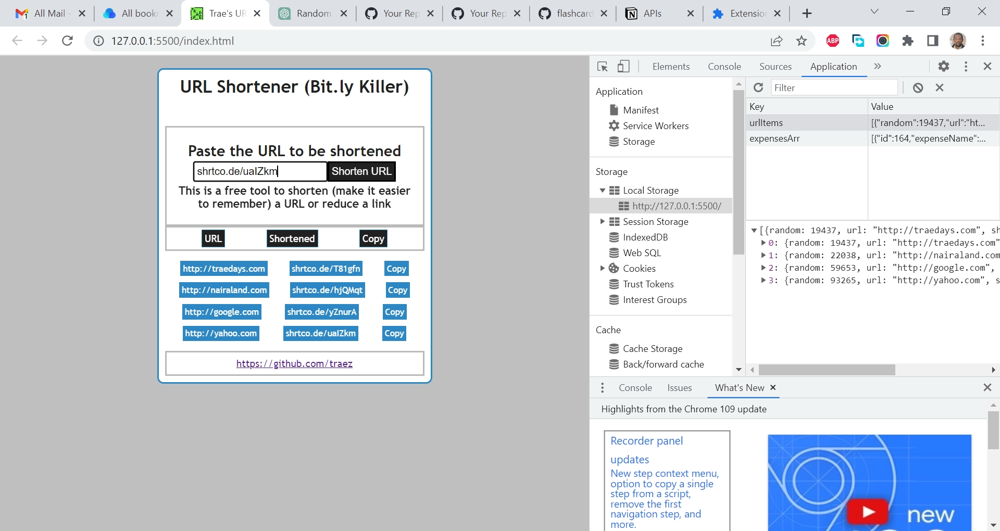

# frontendmentor.io - URL Shortener API JavaScript Project

This is a modified solution to the [URL shortening API landing page challenge on Frontend Mentor](https://www.frontendmentor.io/challenges/url-shortening-api-landing-page-2ce3ob-G/). Frontend Mentor challenges help you improve your coding skills by building realistic projects. 

## Table of contents

- [Overview](#overview)
  - [The challenge](#the-challenge)
  - [Screenshot](#screenshot)
  - [Links](#links)
  - [My process](#my-process)
  - [Built with](#built-with)
  - [What I learned](#what-i-learned)
  - [Continued development](#continued-development)
  - [Useful resources](#useful-resources)
  - [Author](#author)
  - [Acknowledgments](#acknowledgments)

## Overview

### The challenge

- The objective of this project is to integrate with the shrtcode API to create shortened URLs and display them like in the designs. 

### Screenshot

### Links

- Solution URL: [https://github.com/traez/quiz-app-project-using-fetch-api-and-javascript](https://github.com/traez/quiz-app-project-using-fetch-api-and-javascript)
- Live Site URL: [https://traez.github.io/quiz-app-project-using-fetch-api-and-javascript/](https://traez.github.io/quiz-app-project-using-fetch-api-and-javascript/)

## My process

### Built with

- Semantic HTML5 markup
- CSS custom properties
- Flexbox
- CSS Grid
- Mobile-first workflow
- Vanilla JavaScript

### What I learned

- Project was an API - localStorage combo. Many websites now integrate URL shortening as part of their normal workflow. Still I enjoyed proving my skills building this bit.ly killer.  
- frontendmentor.io challenges are heavy on CSS, so had to modify challenge being that JavaScript is my main focus currently. Project meets all JavaScript features of original frontendmentor project, but with much lighter CSS effects.     

### Continued development

- Asynchronous JS & APIs -> Testing -> Intermediate Git -> React     

### Useful resources

Stackoverflow  
MDN Web Docs  
w3schools  
YouTube  
Google  
ChatGPT OpenAI chatbot  

## Author

- Website - [Trae Zeeofor](https://github.com/traez)  
- Twitter - [@trae_z](https://twitter.com/trae_z) 

## Acknowledgments

To the set of 83 who turn 40 this year. Smash those goals people and enter the 4th floor with grace.   
